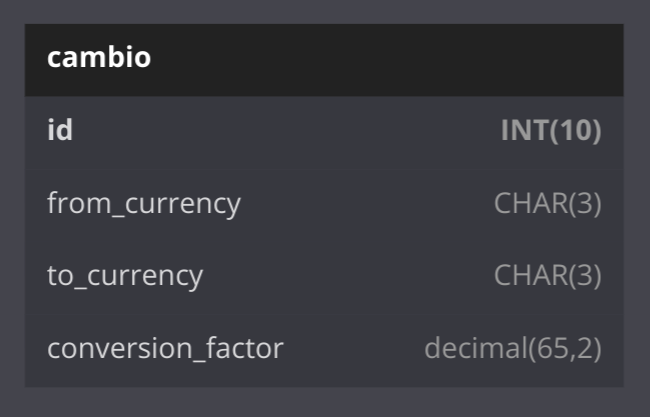
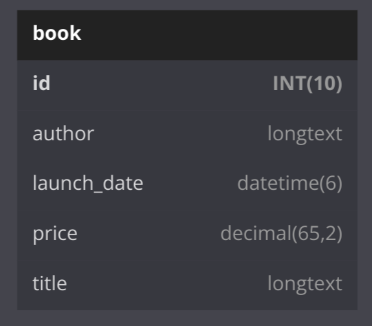

<h1 align="center"> International Library (Livraria Internacional) </h1>

 <a href="#about">Sobre</a> |
 <a href="#entities">Entidades</a> |
 <a href="#microservices">Microserviços</a> |

<h2 id="about">💡&nbsp; Sobre o projeto</h2>

Sistema de conversão de cambio de acordo com a cotação atual no banco de dados para uma livraria internacional, desenvido na arquitetura de micro serviços.

---

<h2 id="entities">👥&nbsp; Entidades </h2>

  
  

---

<h2 id="microservices">📍&nbsp; Microserviçosços </h2>

 

---

<h2 id="author">👨‍💻&nbsp;Desenvolvedor</h2>

👤 [Riquelme Damião Silva](https://github.com/the-riquelme)
